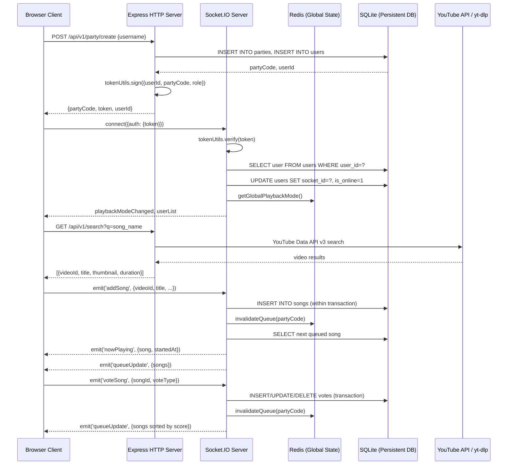
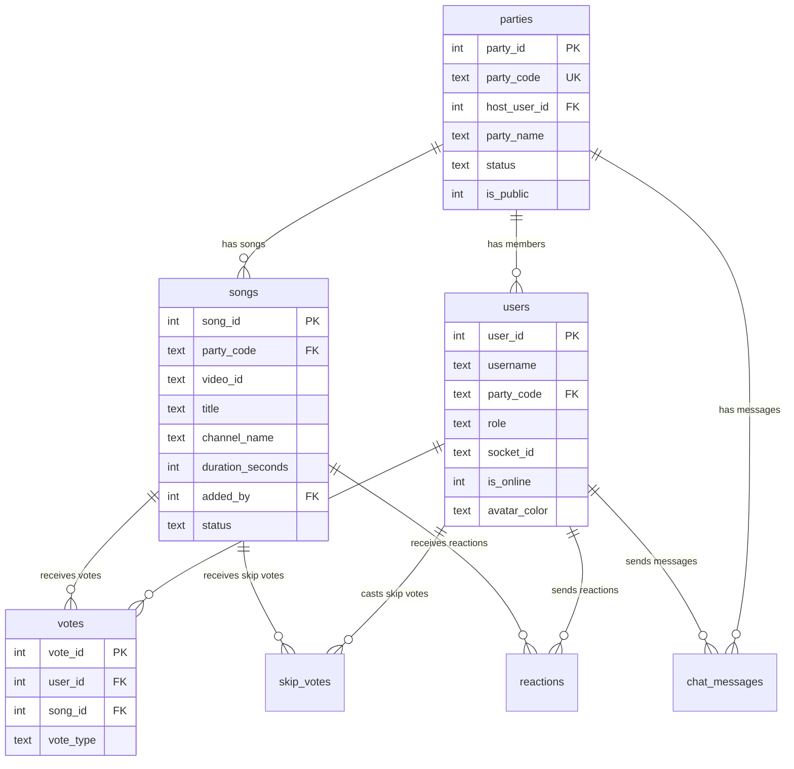
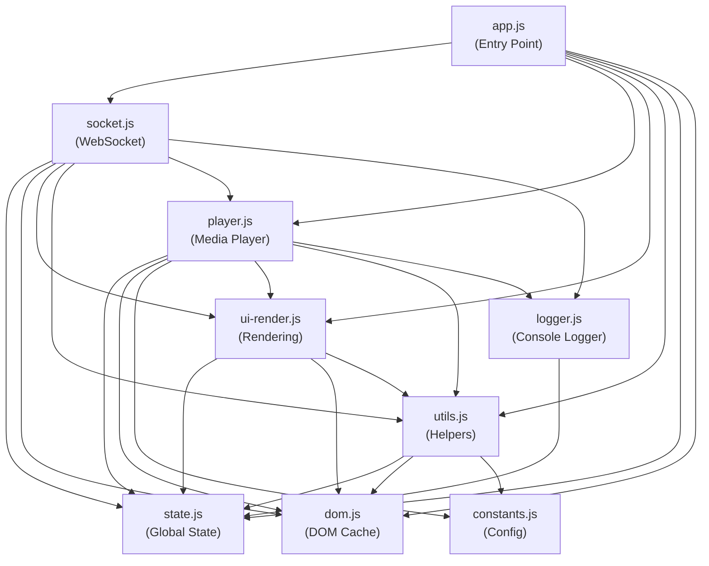

# Bajao Bhai — Complete Technical Architecture & Code Reference Manual

> This is the **single exhaustive engineering document** for the Bajao Bhai project. It covers every file, every function, every feature, system limitations, deployment roadmap, and a complete user guide for operating the web app.

---

## Table of Contents

1. [System Architecture & Data Flow](#1-system-architecture--data-flow)
2. [Complete File Inventory](#2-complete-file-inventory)
3. [Dependency Deep-Dive (Every Import Explained)](#3-dependency-deep-dive)
4. [Database Layer — Schema, Queries, Transactions](#4-database-layer)
5. [Distributed System Internals](#5-distributed-system-internals)
6. [Server Boot Sequence — What Happens When You Start](#6-server-boot-sequence)
7. [REST API Layer — Every Route Explained](#7-rest-api-layer)
8. [WebSocket Layer — Real-Time Event System](#8-websocket-layer)
9. [Client Architecture — Frontend Modules](#9-client-architecture)
10. [Real-Time Sync Engine — How Music Stays In Sync](#10-real-time-sync-engine)
11. [Security Architecture](#11-security-architecture)
12. [Complete Feature List (with Technical Difficulties & Solutions)](#12-complete-feature-list)
13. [System Limitations & Load Capacity](#13-system-limitations--load-capacity)
14. [Future Deployment Recommendations](#14-future-deployment-recommendations)
15. [How to Use Bajao Bhai — User Guide](#15-how-to-use-bajao-bhai--user-guide)
16. [Architectural Decisions: "Why This?" & "What If?"](#16-architectural-decisions-why-this--what-if)
17. [Environment Configuration Reference](#17-environment-configuration-reference)

---

## 1. System Architecture & Data Flow

### 1.1 What Bajao Bhai Is
Bajao Bhai is a **real-time collaborative music queue application** for parties. One user creates a "party" (becomes the host), others join with a 6-character code. Everyone can search YouTube, add songs to a shared queue, vote on what plays next, and hear the same song at the same time.

### 1.2 The Full Data Flow (End-to-End)


### 1.3 Architecture Layers
```
┌──────────────────────────────────────────────────────────┐
│                    CLIENT (Browser)                       │
│  index.html → party.html → app.js → modules/            │
│  [state.js, socket.js, player.js, ui-render.js, ...]     │
├──────────────────────────────────────────────────────────┤
│                HTTP LAYER (Express)                       │
│  server/index.js → routes/                               │
│  [party.js, search.js, queue.js, vote.js, stream.js,     │
│   user.js, admin.js]                                     │
├──────────────────────────────────────────────────────────┤
│              WEBSOCKET LAYER (Socket.IO)                  │
│  server/sockets/index.js →                               │
│  [queueHandler.js, leaderElection.js, chatHandler.js,    │
│   userListBroadcast.js]                                  │
├──────────────────────────────────────────────────────────┤
│                 UTILITY LAYER                             │
│  server/utils/                                           │
│  [redisClient.js, tokenUtils.js, rateLimiter.js,         │
│   nodeRegistry.js, partyCleanup.js, codeGenerator.js,    │
│   logger.js]                                             │
├──────────────────────────────────────────────────────────┤
│                 STORAGE LAYER                             │
│  SQLite (data/bajao_bhai.db) + Redis (127.0.0.1:6379)    │
│  Schema: db/schema_v3.sql                                │
└──────────────────────────────────────────────────────────┘
```

---

## 2. Complete File Inventory

### Server Files (27 files)

| File | Purpose | Lines | Connects To |
|:-----|:--------|------:|:------------|
| [server/index.js](file:///c:/Users/radhe/Desktop/Bajao%20Bhai/server/index.js) | Application entry point, middleware setup, boot sequence | 185 | Every route, sockets, db, redis, nodeRegistry |
| [server/db.js](file:///c:/Users/radhe/Desktop/Bajao%20Bhai/server/db.js) | SQLite connection, query engine, transaction wrapper, migrations | 340 | Used by ALL routes and ALL socket handlers |
| [server/sockets/index.js](file:///c:/Users/radhe/Desktop/Bajao%20Bhai/server/sockets/index.js) | Socket.IO initialization, auth middleware, connection handler | 209 | tokenUtils, queueHandler, leaderElection, chatHandler, userListBroadcast, redisClient |
| [server/sockets/queueHandler.js](file:///c:/Users/radhe/Desktop/Bajao%20Bhai/server/sockets/queueHandler.js) | Song queue management, voting, playback control, skip logic | 845 | db, redisClient, rateLimiter, userListBroadcast |
| [server/sockets/leaderElection.js](file:///c:/Users/radhe/Desktop/Bajao%20Bhai/server/sockets/leaderElection.js) | Automatic host promotion on disconnect, grace periods | 194 | db, redisClient, partyCleanup, userListBroadcast |
| [server/sockets/chatHandler.js](file:///c:/Users/radhe/Desktop/Bajao%20Bhai/server/sockets/chatHandler.js) | In-party text chat, message persistence, typing indicators | 110 | db, rateLimiter, xss |
| [server/sockets/userListBroadcast.js](file:///c:/Users/radhe/Desktop/Bajao%20Bhai/server/sockets/userListBroadcast.js) | Deduplication-aware user list emission | 43 | Used by sockets/index.js, queueHandler, leaderElection |
| [server/routes/party.js](file:///c:/Users/radhe/Desktop/Bajao%20Bhai/server/routes/party.js) | Create party, join party, list public parties | 176 | db, codeGenerator, tokenUtils |
| [server/routes/search.js](file:///c:/Users/radhe/Desktop/Bajao%20Bhai/server/routes/search.js) | YouTube search proxy with in-memory cache | 222 | tokenUtils, node-fetch, YouTube API |
| [server/routes/queue.js](file:///c:/Users/radhe/Desktop/Bajao%20Bhai/server/routes/queue.js) | REST queue operations (get, add, export) | 179 | db, redisClient, tokenUtils, queueHandler |
| [server/routes/vote.js](file:///c:/Users/radhe/Desktop/Bajao%20Bhai/server/routes/vote.js) | REST vote endpoint (alternative to socket voting) | 88 | db, tokenUtils, redisClient, queueHandler |
| [server/routes/stream.js](file:///c:/Users/radhe/Desktop/Bajao%20Bhai/server/routes/stream.js) | Server-side YouTube audio proxy via yt-dlp | 113 | youtube-dl-exec, node-fetch, redisClient |
| [server/routes/user.js](file:///c:/Users/radhe/Desktop/Bajao%20Bhai/server/routes/user.js) | User profile updates | 28 | db, tokenUtils |
| [server/routes/admin.js](file:///c:/Users/radhe/Desktop/Bajao%20Bhai/server/routes/admin.js) | Admin monitoring dashboard API and global system configurations | 784 | db, nodeRegistry, partyCleanup, redisClient, systemHealth |
| [server/utils/systemHealth.js](file:///c:/Users/radhe/Desktop/Bajao%20Bhai/server/utils/systemHealth.js) | Centralized health tracker, monitors YouTube API quota and yt-dlp playback errors | 197 | logger; Used by admin.js, stream.js, search.js |
| [server/utils/redisClient.js](file:///c:/Users/radhe/Desktop/Bajao%20Bhai/server/utils/redisClient.js) | Redis connection, queue cache, now-playing state, playback mode | 165 | ioredis; Used by queueHandler, leaderElection, rateLimiter, stream, nodeRegistry, partyCleanup |
| [server/utils/tokenUtils.js](file:///c:/Users/radhe/Desktop/Bajao%20Bhai/server/utils/tokenUtils.js) | Custom JWT signing/verification with HMAC-SHA256 | 116 | crypto; Used by party.js, search.js, queue.js, vote.js, user.js, sockets/index.js |
| [server/utils/rateLimiter.js](file:///c:/Users/radhe/Desktop/Bajao%20Bhai/server/utils/rateLimiter.js) | Redis-backed distributed rate limiting with in-memory fallback | 76 | redisClient; Used by queueHandler, chatHandler |
| [server/utils/nodeRegistry.js](file:///c:/Users/radhe/Desktop/Bajao%20Bhai/server/utils/nodeRegistry.js) | Multi-node heartbeat and cluster discovery | 92 | redisClient; Used by index.js, admin.js, logger.js |
| [server/utils/partyCleanup.js](file:///c:/Users/radhe/Desktop/Bajao%20Bhai/server/utils/partyCleanup.js) | Zombie party detection, Redis state cleanup, party termination | 110 | db, redisClient; Used by index.js, leaderElection, admin.js |
| [server/utils/codeGenerator.js](file:///c:/Users/radhe/Desktop/Bajao%20Bhai/server/utils/codeGenerator.js) | Collision-safe 6-character party code generator | 29 | db; Used by party.js |
| [server/utils/logger.js](file:///c:/Users/radhe/Desktop/Bajao%20Bhai/server/utils/logger.js) | Structured file+console logger with NODE_ID tagging | 42 | nodeRegistry; Used by nearly every server file |
| [db/schema_v3.sql](file:///c:/Users/radhe/Desktop/Bajao%20Bhai/db/schema_v3.sql) | Database schema definition (7 tables) | 102 | Loaded by db.js at startup |

### Client Files (10 files)

| File | Purpose | Lines | Connects To |
|:-----|:--------|------:|:------------|
| [client/index.html](file:///c:/Users/radhe/Desktop/Bajao%20Bhai/client/index.html) | Landing page — create/join party UI | ~500 | style.css, inline JS |
| [client/party.html](file:///c:/Users/radhe/Desktop/Bajao%20Bhai/client/party.html) | Party room page — player, queue, chat | ~200 | app.js, style.css, socket.io, YouTube IFrame API |
| [client/app.js](file:///c:/Users/radhe/Desktop/Bajao%20Bhai/client/app.js) | Main party application entry — wires everything together | ~800 | All client modules |
| [client/modules/state.js](file:///c:/Users/radhe/Desktop/Bajao%20Bhai/client/modules/state.js) | Global reactive state object (29 properties) | 30 | Imported by every other module |
| [client/modules/dom.js](file:///c:/Users/radhe/Desktop/Bajao%20Bhai/client/modules/dom.js) | Cached DOM element references (30 elements) | 34 | Imported by socket.js, player.js, ui-render.js, utils.js |
| [client/modules/socket.js](file:///c:/Users/radhe/Desktop/Bajao%20Bhai/client/modules/socket.js) | Socket.IO client: all event listeners for real-time updates | 265 | state, dom, ui-render, utils, player, logger |
| [client/modules/player.js](file:///c:/Users/radhe/Desktop/Bajao%20Bhai/client/modules/player.js) | YouTube IFrame + HTML5 Audio player management, drift sync | 262 | state, dom, constants, ui-render, utils, logger |
| [client/modules/ui-render.js](file:///c:/Users/radhe/Desktop/Bajao%20Bhai/client/modules/ui-render.js) | DOM rendering functions (queue, users, chat, icons) | 143 | state, dom, utils |
| [client/modules/utils.js](file:///c:/Users/radhe/Desktop/Bajao%20Bhai/client/modules/utils.js) | Helper functions (toast, session, formatting) | 63 | state, dom, constants |
| [client/modules/constants.js](file:///c:/Users/radhe/Desktop/Bajao%20Bhai/client/modules/constants.js) | Sync thresholds, debounce timing, UI timing constants | 15 | Imported by player.js |
| [client/modules/logger.js](file:///c:/Users/radhe/Desktop/Bajao%20Bhai/client/modules/logger.js) | Color-coded browser console logger with in-memory log buffer | 47 | state |

---

## 3. Dependency Deep-Dive

### 3.1 Why Each npm Package Exists

| Package | Version | Why It's Needed | Where It's Used |
|:--------|:--------|:----------------|:----------------|
| `express` | 5.2+ | HTTP server framework; serves REST APIs and static files | [server/index.js:L2](file:///c:/Users/radhe/Desktop/Bajao%20Bhai/server/index.js#L2) |
| `socket.io` | 4.8+ | Real-time bidirectional WebSocket communication | [sockets/index.js:L1](file:///c:/Users/radhe/Desktop/Bajao%20Bhai/server/sockets/index.js#L1) |
| `@socket.io/redis-adapter` | 8.3+ | Allows Socket.IO events to propagate across multiple Node.js processes via Redis Pub/Sub | [redisClient.js:L117](file:///c:/Users/radhe/Desktop/Bajao%20Bhai/server/utils/redisClient.js#L117) |
| `ioredis` | 5.10+ | Redis client for caching queue state, now-playing, locks, rate limits, and node heartbeats | [redisClient.js:L1-7](file:///c:/Users/radhe/Desktop/Bajao%20Bhai/server/utils/redisClient.js#L1-7) |
| `better-sqlite3` | 12.6+ | Synchronous SQLite driver with WAL mode for high-concurrency reads | [db.js:L1](file:///c:/Users/radhe/Desktop/Bajao%20Bhai/server/db.js#L1) |
| `play-dl` | 1.9+ | YouTube cookie authentication for streaming (avoids bot detection) | [server/index.js:L109](file:///c:/Users/radhe/Desktop/Bajao%20Bhai/server/index.js#L109) |
| `youtube-dl-exec` | 3.1+ | Extracts direct audio URLs from YouTube for server-side stream proxying | [stream.js:L3](file:///c:/Users/radhe/Desktop/Bajao%20Bhai/server/routes/stream.js#L3) |
| `@distube/ytdl-core` | 4.16+ | Alternative YouTube downloader (fallback for play-dl) | [package.json:L38](file:///c:/Users/radhe/Desktop/Bajao%20Bhai/package.json#L38) |
| `node-fetch` | 2.7+ | HTTP client for proxying YouTube API calls and streaming media | [search.js:L3](file:///c:/Users/radhe/Desktop/Bajao%20Bhai/server/routes/search.js#L3), [stream.js:L4](file:///c:/Users/radhe/Desktop/Bajao%20Bhai/server/routes/stream.js#L4) |
| `compression` | 1.8+ | Gzip compresses HTTP responses for faster page loads | [server/index.js:L33](file:///c:/Users/radhe/Desktop/Bajao%20Bhai/server/index.js#L33) |
| `cors` | 2.8+ | Cross-Origin Resource Sharing headers (installed but not actively used — using Socket.IO's built-in CORS) | [package.json:L41](file:///c:/Users/radhe/Desktop/Bajao%20Bhai/package.json#L41) |
| `dotenv` | 17.3+ | Loads `.env` file into `process.env` for secrets and config | [server/index.js:L7](file:///c:/Users/radhe/Desktop/Bajao%20Bhai/server/index.js#L7) |
| `express-rate-limit` | 8.3+ | HTTP-level rate limiting (1000 requests per 15 min per IP) | [server/index.js:L35-40](file:///c:/Users/radhe/Desktop/Bajao%20Bhai/server/index.js#L35-40) |
| `helmet` | 8.1+ | Security headers (installed but currently disabled for debugging) | [package.json:L46](file:///c:/Users/radhe/Desktop/Bajao%20Bhai/package.json#L46) |
| `xss` | 1.0+ | Sanitizes user input in chat messages to prevent XSS attacks | [chatHandler.js:L3](file:///c:/Users/radhe/Desktop/Bajao%20Bhai/server/sockets/chatHandler.js#L3) |

---

## 4. Database Layer

### 4.1 Schema (7 Tables)
Defined in [db/schema_v3.sql](file:///c:/Users/radhe/Desktop/Bajao%20Bhai/db/schema_v3.sql):



### 4.2 How the Database Module Works
**File**: [server/db.js](file:///c:/Users/radhe/Desktop/Bajao%20Bhai/server/db.js)

| Function | Line | What It Does | Connected To |
|:---------|-----:|:-------------|:-------------|
| `query(sql, params)` | [L53-88](file:///c:/Users/radhe/Desktop/Bajao%20Bhai/server/db.js#L53-88) | Executes any SQL. Routes `SELECT`→`.all()`, `INSERT/UPDATE/DELETE`→`.run()`. Returns rows or `{insertId, changes}`. | Every route and socket handler |
| `getCachedStatement(sql)` | [L34-48](file:///c:/Users/radhe/Desktop/Bajao%20Bhai/server/db.js#L34-48) | LRU cache of 200 prepared statements. Avoids re-parsing SQL on every call. | Called by `query()` |
| `runTransactionSync(input)` | [L92-113](file:///c:/Users/radhe/Desktop/Bajao%20Bhai/server/db.js#L92-113) | Wraps multiple queries in a single atomic SQLite transaction using `better-sqlite3`'s native `.transaction()`. Prevents partial writes. | party.js (create), queueHandler.js (addSong, voteSong, skipVote, relinquishHost), queue.js (add), admin.js (delete party) |
| `initSchema()` | [L309-331](file:///c:/Users/radhe/Desktop/Bajao%20Bhai/server/db.js#L309-331) | Reads `schema_v3.sql`, executes each statement, then runs `applyMigrations()`. | Called once during server boot in [index.js:L150](file:///c:/Users/radhe/Desktop/Bajao%20Bhai/server/index.js#L150) |
| `applyMigrations()` | [L185-272](file:///c:/Users/radhe/Desktop/Bajao%20Bhai/server/db.js#L185-272) | Safe `ALTER TABLE` additions, index creation, duplicate vote cleanup. | Called by `initSchema()` |

### 4.3 WAL Mode & Pragmas
```
PRAGMA foreign_keys = ON    → Enforces referential integrity
PRAGMA journal_mode = WAL   → Write-Ahead Logging: multiple readers + 1 writer concurrently
PRAGMA synchronous = NORMAL → Faster writes (safe with WAL mode)
```
Set at [db.js:L12-14](file:///c:/Users/radhe/Desktop/Bajao%20Bhai/server/db.js#L12-14).

---

## 5. Distributed System Internals

### 5.1 Redis as the Global Brain
**File**: [server/utils/redisClient.js](file:///c:/Users/radhe/Desktop/Bajao%20Bhai/server/utils/redisClient.js)

Redis stores **5 categories** of data across the cluster:

| Redis Key Pattern | Purpose | TTL | Functions |
|:------------------|:--------|:----|:----------|
| `node:NODE_ID` | Node heartbeat (health check) | 15s | [nodeRegistry.js:L38](file:///c:/Users/radhe/Desktop/Bajao%20Bhai/server/utils/nodeRegistry.js#L38) `registerNode()` |
| `queue:PARTY_CODE` | Cached queue with vote scores | 600s | [redisClient.js:L51-79](file:///c:/Users/radhe/Desktop/Bajao%20Bhai/server/utils/redisClient.js#L51-79) `getCachedQueue()`, `setCachedQueue()`, `invalidateQueue()` |
| `nowPlaying:PARTY_CODE` | Current song state (songId, startedAt, isPlaying, progress) | 6h | [redisClient.js:L81-111](file:///c:/Users/radhe/Desktop/Bajao%20Bhai/server/utils/redisClient.js#L81-111) `getNowPlayingState()`, `setNowPlayingState()`, `clearNowPlayingState()` |
| `election:PARTY_CODE` | Distributed mutex preventing dual host promotions | 5s | [leaderElection.js:L24-39](file:///c:/Users/radhe/Desktop/Bajao%20Bhai/server/sockets/leaderElection.js#L24-39) `tryAcquireElectionLock()` |
| `rl:SCOPE:SUBJECT_ID` | Rate limit counters per user per action | variable | [rateLimiter.js:L48-59](file:///c:/Users/radhe/Desktop/Bajao%20Bhai/server/utils/rateLimiter.js#L48-59) `allowEvent()` |
| `stream:info:VIDEO_ID` | Cached YouTube metadata (title, duration, URL) | 3h | [stream.js:L13-35](file:///c:/Users/radhe/Desktop/Bajao%20Bhai/server/routes/stream.js#L13-35) `getCachedInfo()`, `setCachedInfo()` |
| `global:playbackMode` | API vs Stream mode toggle | none | [redisClient.js:L19-37](file:///c:/Users/radhe/Desktop/Bajao%20Bhai/server/utils/redisClient.js#L19-37) `getGlobalPlaybackMode()`, `setGlobalPlaybackMode()` |

### 5.2 Graceful Redis Fallback
Every Redis function checks `isRedisReady()` ([redisClient.js:L47-49](file:///c:/Users/radhe/Desktop/Bajao%20Bhai/server/utils/redisClient.js#L47-49)) first. If Redis is down:
- **Queue cache** → Falls through to SQLite query (no cache)
- **NowPlaying state** → Falls back to in-memory `fallbackNowPlaying` Map ([L16](file:///c:/Users/radhe/Desktop/Bajao%20Bhai/server/utils/redisClient.js#L16))
- **Playback mode** → Falls back to in-memory `fallbackPlaybackMode` variable ([L17](file:///c:/Users/radhe/Desktop/Bajao%20Bhai/server/utils/redisClient.js#L17))
- **Rate limiting** → Falls back to local `Map` with TTL sweep ([rateLimiter.js:L3-13](file:///c:/Users/radhe/Desktop/Bajao%20Bhai/server/utils/rateLimiter.js#L3-13))

### 5.3 Leader Election (Host Failover)
**File**: [server/sockets/leaderElection.js](file:///c:/Users/radhe/Desktop/Bajao%20Bhai/server/sockets/leaderElection.js)

**Full flow when a host disconnects:**
1. `socket.on('disconnect')` fires → [L88](file:///c:/Users/radhe/Desktop/Bajao%20Bhai/server/sockets/leaderElection.js#L88)
2. User marked offline in DB → [L95](file:///c:/Users/radhe/Desktop/Bajao%20Bhai/server/sockets/leaderElection.js#L95)
3. If user was `host`, schedule election after `HOST_RECONNECT_GRACE_MS` (default 15s) → [L102](file:///c:/Users/radhe/Desktop/Bajao%20Bhai/server/sockets/leaderElection.js#L102)
4. Acquire Redis mutex `election:PARTY_CODE` using `SET NX PX 5000` → [L166](file:///c:/Users/radhe/Desktop/Bajao%20Bhai/server/sockets/leaderElection.js#L166)
5. After grace period, check if host reconnected → [L105-113](file:///c:/Users/radhe/Desktop/Bajao%20Bhai/server/sockets/leaderElection.js#L105-113)
6. If not, find oldest online `guest` → [L115-117](file:///c:/Users/radhe/Desktop/Bajao%20Bhai/server/sockets/leaderElection.js#L115-117)
7. Promote: `UPDATE users SET role='host'`, `UPDATE parties SET host_user_id=?` → [L122-126](file:///c:/Users/radhe/Desktop/Bajao%20Bhai/server/sockets/leaderElection.js#L122-126)
8. Sync in-memory socket state → [L129-134](file:///c:/Users/radhe/Desktop/Bajao%20Bhai/server/sockets/leaderElection.js#L129-134)
9. Broadcast `hostChanged` to all party members → [L136-141](file:///c:/Users/radhe/Desktop/Bajao%20Bhai/server/sockets/leaderElection.js#L136-141)
10. If zero guests online, schedule `noUsersEndTimer` → [L154](file:///c:/Users/radhe/Desktop/Bajao%20Bhai/server/sockets/leaderElection.js#L154)

### 5.4 Zombie Party Cleanup
**File**: [server/utils/partyCleanup.js](file:///c:/Users/radhe/Desktop/Bajao%20Bhai/server/utils/partyCleanup.js)

- `runGlobalZombieCleanup(io)` → [L67-102](file:///c:/Users/radhe/Desktop/Bajao%20Bhai/server/utils/partyCleanup.js#L67-102): Finds parties marked `active` in DB but with **zero** online users, then terminates them.
- `endParty(io, partyCode, reason)` → [L38-65](file:///c:/Users/radhe/Desktop/Bajao%20Bhai/server/utils/partyCleanup.js#L38-65): Sets party status to `ended`, clears all Redis keys for that party, emits `partyEnded` to all sockets, then forcibly disconnects them.
- `clearRedisPartyState(partyCode)` → [L17-36](file:///c:/Users/radhe/Desktop/Bajao%20Bhai/server/utils/partyCleanup.js#L17-36): Uses Redis `SCAN` to find and delete all keys matching `queue:CODE`, `nowPlaying:CODE`, `election:CODE`, `rl:*:CODE:*`.
- Cleanup runs every 10 minutes → [index.js:L155](file:///c:/Users/radhe/Desktop/Bajao%20Bhai/server/index.js#L155)

---

## 6. Server Boot Sequence

What happens when you run `npm start` → [server/index.js](file:///c:/Users/radhe/Desktop/Bajao%20Bhai/server/index.js):

| Step | Line | What Happens |
|-----:|-----:|:-------------|
| 1 | [L7](file:///c:/Users/radhe/Desktop/Bajao%20Bhai/server/index.js#L7) | `dotenv.config()` → loads `.env` into `process.env` |
| 2 | [L94-98](file:///c:/Users/radhe/Desktop/Bajao%20Bhai/server/index.js#L94-98) | Validates `TOKEN_SECRET` and `ADMIN_SECRET` exist |
| 3 | [L105](file:///c:/Users/radhe/Desktop/Bajao%20Bhai/server/index.js#L105) | `connectRedis()` → establishes Redis connection |
| 4 | [L108-139](file:///c:/Users/radhe/Desktop/Bajao%20Bhai/server/index.js#L108-139) | Initializes `play-dl` with YouTube cookies from `cookies.json` |
| 5 | [L142](file:///c:/Users/radhe/Desktop/Bajao%20Bhai/server/index.js#L142) | `initSocket(server)` → creates Socket.IO server with auth middleware |
| 6 | [L149-150](file:///c:/Users/radhe/Desktop/Bajao%20Bhai/server/index.js#L149-150) | `pool.query('SELECT 1')` → verifies DB connection; `initSchema()` → creates tables + runs migrations |
| 7 | [L154-155](file:///c:/Users/radhe/Desktop/Bajao%20Bhai/server/index.js#L154-155) | Starts zombie cleanup + schedules every 10 min |
| 8 | [L157](file:///c:/Users/radhe/Desktop/Bajao%20Bhai/server/index.js#L157) | `startNodeHeartbeat()` → registers node in Redis, heartbeats every 10s |
| 9 | [L174-177](file:///c:/Users/radhe/Desktop/Bajao%20Bhai/server/index.js#L174-177) | `server.listen(PORT)` → starts accepting connections |

---

## 7. REST API Layer

### 7.1 Party Routes — [server/routes/party.js](file:///c:/Users/radhe/Desktop/Bajao%20Bhai/server/routes/party.js)

| Endpoint | Method | Auth | What It Does | Key Lines |
|:---------|:-------|:-----|:-------------|:----------|
| `/api/v1/party/create` | POST | None | Creates a new party with unique 6-char code, registers host user, returns JWT token | [L97-153](file:///c:/Users/radhe/Desktop/Bajao%20Bhai/server/routes/party.js#L97-153) |
| `/api/v1/party/join` | POST | None | Validates party exists and is active, registers guest user, returns JWT token | [L41-94](file:///c:/Users/radhe/Desktop/Bajao%20Bhai/server/routes/party.js#L41-94) |
| `/api/v1/party/public` | GET | None | Lists up to 20 active public parties sorted by user count | [L157-173](file:///c:/Users/radhe/Desktop/Bajao%20Bhai/server/routes/party.js#L157-173) |

**Code Generator** ([codeGenerator.js](file:///c:/Users/radhe/Desktop/Bajao%20Bhai/server/utils/codeGenerator.js)): Generates `ABCDEFGHIJKLMNOPQRSTUVWXYZ0123456789` codes, checks DB for collision, retries up to 10 times.

### 7.2 Search Routes — [server/routes/search.js](file:///c:/Users/radhe/Desktop/Bajao%20Bhai/server/routes/search.js)

| Endpoint | Method | Auth | What It Does | Key Lines |
|:---------|:-------|:-----|:-------------|:----------|
| `/api/v1/search?q=...` | GET | Token | Searches YouTube, fetches durations, returns results. Has 15-min in-memory cache (100 entries max). | [L108-219](file:///c:/Users/radhe/Desktop/Bajao%20Bhai/server/routes/search.js#L108-219) |
| `/api/v1/search/key-status` | GET | Token | Probes YouTube API key health | [L101-106](file:///c:/Users/radhe/Desktop/Bajao%20Bhai/server/routes/search.js#L101-106) |

**Duration parsing**: `parseIsoDurationToSeconds("PT3M45S")` → `225` → [L34-42](file:///c:/Users/radhe/Desktop/Bajao%20Bhai/server/routes/search.js#L34-42)

### 7.3 Stream Route — [server/routes/stream.js](file:///c:/Users/radhe/Desktop/Bajao%20Bhai/server/routes/stream.js)

| Endpoint | Method | Auth | What It Does | Key Lines |
|:---------|:-------|:-----|:-------------|:----------|
| `/api/v1/stream/:videoId` | GET | None | Extracts direct audio URL via `yt-dlp`, proxies audio stream to client | [L37-109](file:///c:/Users/radhe/Desktop/Bajao%20Bhai/server/routes/stream.js#L37-109) |

**How streaming works step by step:**
1. `yt-dlp` extracts the direct CDN URL for `bestaudio` format → [L48-56](file:///c:/Users/radhe/Desktop/Bajao%20Bhai/server/routes/stream.js#L48-56)
2. If `?start=120` is passed, the `begin` parameter (in ms) is added to the CDN URL → [L71-75](file:///c:/Users/radhe/Desktop/Bajao%20Bhai/server/routes/stream.js#L71-75)
3. `node-fetch` opens a connection to the CDN with spoofed YouTube headers → [L78-85](file:///c:/Users/radhe/Desktop/Bajao%20Bhai/server/routes/stream.js#L78-85)
4. The response body is piped directly to the Express response → [L102](file:///c:/Users/radhe/Desktop/Bajao%20Bhai/server/routes/stream.js#L102)
5. `Transfer-Encoding: chunked` ensures the audio streams progressively → [L93](file:///c:/Users/radhe/Desktop/Bajao%20Bhai/server/routes/stream.js#L93)

---

## 8. WebSocket Layer

### 8.1 Connection Lifecycle — [server/sockets/index.js](file:///c:/Users/radhe/Desktop/Bajao%20Bhai/server/sockets/index.js)

1. **Auth middleware** ([L61-118](file:///c:/Users/radhe/Desktop/Bajao%20Bhai/server/sockets/index.js#L61-118)): Verifies JWT, looks up user in DB, checks party is active, sets `socket.user`.
2. **Room join** ([L129](file:///c:/Users/radhe/Desktop/Bajao%20Bhai/server/sockets/index.js#L129)): `socket.join(partyCode)` — all events to/from a party go through this Socket.IO room.
3. **Handler registration** ([L167-169](file:///c:/Users/radhe/Desktop/Bajao%20Bhai/server/sockets/index.js#L167-169)): Attaches `queueHandler`, `leaderElection`, `chatHandler` to each socket.
4. **Disconnect cleanup** ([L171-189](file:///c:/Users/radhe/Desktop/Bajao%20Bhai/server/sockets/index.js#L171-189)): Removes user from in-memory map, broadcasts updated user list.

### 8.2 All Socket Events (Complete List)

**Client → Server Events:**

| Event | Handler | File:Line | What It Does |
|:------|:--------|:----------|:-------------|
| `addSong` | queueHandler | [queueHandler.js:L524-599](file:///c:/Users/radhe/Desktop/Bajao%20Bhai/server/sockets/queueHandler.js#L524-599) | Validates song, checks 3-song-per-guest limit, checks duplicates, inserts into DB, starts playback if queue was empty |
| `voteSong` | queueHandler | [queueHandler.js:L602-637](file:///c:/Users/radhe/Desktop/Bajao%20Bhai/server/sockets/queueHandler.js#L602-637) | Toggle vote (same vote removes, different vote switches), re-sorts queue |
| `skipSong` | queueHandler | [queueHandler.js:L640-694](file:///c:/Users/radhe/Desktop/Bajao%20Bhai/server/sockets/queueHandler.js#L640-694) | Host-only direct skip of current or queued song |
| `skipVote` | queueHandler | [queueHandler.js:L697-764](file:///c:/Users/radhe/Desktop/Bajao%20Bhai/server/sockets/queueHandler.js#L697-764) | Guest skip-vote; auto-skips when threshold reached |
| `songEnded` | queueHandler | [queueHandler.js:L489-521](file:///c:/Users/radhe/Desktop/Bajao%20Bhai/server/sockets/queueHandler.js#L489-521) | Host reports song finished; advances to next |
| `hostPlaybackControl` | queueHandler | [queueHandler.js:L380-466](file:///c:/Users/radhe/Desktop/Bajao%20Bhai/server/sockets/queueHandler.js#L380-466) | Play/pause/seek from host; updates NowPlaying state in Redis |
| `relinquishHost` | queueHandler | [queueHandler.js:L320-378](file:///c:/Users/radhe/Desktop/Bajao%20Bhai/server/sockets/queueHandler.js#L320-378) | Host voluntarily transfers role to oldest guest |
| `reactToSong` | queueHandler | [queueHandler.js:L767-800](file:///c:/Users/radhe/Desktop/Bajao%20Bhai/server/sockets/queueHandler.js#L767-800) | Fire/Clap/Dance reaction; persisted to DB, broadcast to party |
| `syncNowPlaying` | queueHandler | [queueHandler.js:L802-810](file:///c:/Users/radhe/Desktop/Bajao%20Bhai/server/sockets/queueHandler.js#L802-810) | Client requests current playback state (used on connect/reconnect) |
| `reconnectHeartbeat` | queueHandler | [queueHandler.js:L812-838](file:///c:/Users/radhe/Desktop/Bajao%20Bhai/server/sockets/queueHandler.js#L812-838) | Re-marks user online, cancels pending elections, syncs state |
| `sendChatMessage` | chatHandler | [chatHandler.js:L31-69](file:///c:/Users/radhe/Desktop/Bajao%20Bhai/server/sockets/chatHandler.js#L31-69) | XSS-sanitized message, persisted to DB, broadcast to party |
| `deleteChatMessage` | chatHandler | [chatHandler.js:L71-96](file:///c:/Users/radhe/Desktop/Bajao%20Bhai/server/sockets/chatHandler.js#L71-96) | Host-only message deletion |
| `syncChatHistory` | chatHandler | [chatHandler.js:L18-29](file:///c:/Users/radhe/Desktop/Bajao%20Bhai/server/sockets/chatHandler.js#L18-29) | Sends last 50 messages to newly connected client |
| `typingIndicator` | chatHandler | [chatHandler.js:L98-108](file:///c:/Users/radhe/Desktop/Bajao%20Bhai/server/sockets/chatHandler.js#L98-108) | Broadcasts "user is typing" to other party members |
| `disconnect` | leaderElection | [leaderElection.js:L88-178](file:///c:/Users/radhe/Desktop/Bajao%20Bhai/server/sockets/leaderElection.js#L88-178) | Marks user offline, triggers host election if needed |

**Server → Client Events:**

| Event | Emitted By | What The Client Does |
|:------|:-----------|:---------------------|
| `queueUpdate` | queueHandler | Updates `state.queue`, re-renders queue list → [socket.js:L84-87](file:///c:/Users/radhe/Desktop/Bajao%20Bhai/client/modules/socket.js#L84-87) |
| `nowPlaying` | queueHandler | Loads new song into player, starts progress timer → [socket.js:L96-101](file:///c:/Users/radhe/Desktop/Bajao%20Bhai/client/modules/socket.js#L96-101) |
| `playbackControl` | queueHandler | Handles play/pause/seek/stop from host → [socket.js:L103-151](file:///c:/Users/radhe/Desktop/Bajao%20Bhai/client/modules/socket.js#L103-151) |
| `userList` | userListBroadcast | Re-renders user badges, syncs role → [socket.js:L89-94](file:///c:/Users/radhe/Desktop/Bajao%20Bhai/client/modules/socket.js#L89-94) |
| `hostChanged` | leaderElection/queueHandler | Updates local role, shows toast → [socket.js:L170-183](file:///c:/Users/radhe/Desktop/Bajao%20Bhai/client/modules/socket.js#L170-183) |
| `hostGranted` | leaderElection/queueHandler | Enables host controls for promoted user → [socket.js:L161-168](file:///c:/Users/radhe/Desktop/Bajao%20Bhai/client/modules/socket.js#L161-168) |
| `skipVoteUpdate` | queueHandler | Updates skip vote counter display → [socket.js:L153-159](file:///c:/Users/radhe/Desktop/Bajao%20Bhai/client/modules/socket.js#L153-159) |
| `partyEnded` | partyCleanup | Clears session, redirects to home → [socket.js:L198-206](file:///c:/Users/radhe/Desktop/Bajao%20Bhai/client/modules/socket.js#L198-206) |
| `chatMessage` | chatHandler | Appends message to chat panel → [socket.js:L208-211](file:///c:/Users/radhe/Desktop/Bajao%20Bhai/client/modules/socket.js#L208-211) |
| `playbackModeChanged` | queueHandler/admin | Switches player between YouTube IFrame and HTML5 Audio → [socket.js:L71-82](file:///c:/Users/radhe/Desktop/Bajao%20Bhai/client/modules/socket.js#L71-82) |

---

## 9. Client Architecture

### 9.1 Module Dependency Graph


### 9.2 Client State Object — [client/modules/state.js](file:///c:/Users/radhe/Desktop/Bajao%20Bhai/client/modules/state.js)
```javascript
state = {
  isPlaying: false,        // Is the player actively playing?
  progressInterval: null,  // setInterval ID for progress bar updates
  queue: [],               // Array of queued songs
  users: [],               // Array of online users in party
  currentSong: null,       // Currently playing song object
  currentStartedAt: null,  // Unix timestamp when current song started
  currentResumeSeconds: null, // Seek offset for late joiners
  currentIsPlaying: true,  // Server's playing/paused state
  socket: null,            // Socket.IO client instance
  player: null,            // YouTube IFrame Player API instance
  playbackMode: 'api',     // 'api' (YouTube IFrame) or 'stream' (server proxy)
  audioFallback: null,     // HTML5 Audio element for stream mode
  session: null,           // {userId, partyCode, token, role, username}
  // ... timing/sync fields
}
```

---

## 10. Real-Time Sync Engine

### 10.1 How All Users Hear the Same Thing at the Same Time

**The Problem**: Network latency, browser tab throttling, and buffering cause each user's playback position to drift.  
**The Solution**: A 3-tier correction system in [player.js:L83-142](file:///c:/Users/radhe/Desktop/Bajao%20Bhai/client/modules/player.js#L83-142):

```
Server broadcasts: startedAt = 1712345678000 (Unix ms)

Client calculates:
  expectedPosition = (Date.now() - startedAt) / 1000
  actualPosition   = player.getCurrentTime()
  drift            = expectedPosition - actualPosition

Correction Rules:
  |drift| > 6.0s  →  Hard reset: reload stream from ?start=expectedPosition
  |drift| > 2.5s  →  Hard sync:  player.seekTo(expectedPosition)
  |drift| > 0.4s  →  Micro-adjust: playbackRate = 1.08 or 0.92
  |drift| < 0.4s  →  Perfect:     playbackRate = 1.0
```

### 10.2 Late-Joiner State Recovery
When a user connects mid-song → [queueHandler.js:L233-270](file:///c:/Users/radhe/Desktop/Bajao%20Bhai/server/sockets/queueHandler.js#L233-270):
1. Server reads `nowPlaying` state from Redis → gets `songId`, `startedAt`, `isPlaying`
2. Calculates elapsed seconds: `(Date.now() - startedAt) / 1000`
3. Sends `resumeSeconds` to new client only
4. Client uses `resumeSeconds` to seek player to correct position → [player.js:L167-171](file:///c:/Users/radhe/Desktop/Bajao%20Bhai/client/modules/player.js#L167-171)

### 10.3 Safety Timer (Server-Side Auto-Advance)
If the host's browser hangs or they close their tab, the server has a backup:
- `scheduleSafetyTimer()` → [queueHandler.js:L47-69](file:///c:/Users/radhe/Desktop/Bajao%20Bhai/server/sockets/queueHandler.js#L47-69)
- Sets a `setTimeout` for `(duration - currentOffset + 5s) * 1000`
- When it fires, it calls `skipSongAndAdvance()` to move to the next song automatically
- This prevents the party from going silent if the host disconnects

---

## 11. Security Architecture

| Security Layer | Implementation | Location |
|:---------------|:---------------|:---------|
| **JWT Auth** | Custom HMAC-SHA256 tokens with 7-day expiry | [tokenUtils.js:L11-29](file:///c:/Users/radhe/Desktop/Bajao%20Bhai/server/utils/tokenUtils.js#L11-29) |
| **Timing-Safe Comparison** | `crypto.timingSafeEqual()` prevents timing attacks | [tokenUtils.js:L65-69](file:///c:/Users/radhe/Desktop/Bajao%20Bhai/server/utils/tokenUtils.js#L65-69) |
| **XSS Prevention** | Chat messages sanitized via `xss()` library | [chatHandler.js:L44](file:///c:/Users/radhe/Desktop/Bajao%20Bhai/server/sockets/chatHandler.js#L44) |
| **Input Sanitization** | Song titles stripped of `<>`, truncated to 200 chars | [queueHandler.js:L549-550](file:///c:/Users/radhe/Desktop/Bajao%20Bhai/server/sockets/queueHandler.js#L549-550) |
| **HTTP Rate Limiting** | 1000 req / 15 min per IP on all `/api/` routes | [index.js:L35-40](file:///c:/Users/radhe/Desktop/Bajao%20Bhai/server/index.js#L35-40) |
| **Socket Rate Limiting** | Per-event limits (e.g., 8 adds/30s, 20 votes/10s, 7 chats/10s) | [queueHandler.js:L527](file:///c:/Users/radhe/Desktop/Bajao%20Bhai/server/sockets/queueHandler.js#L527), [chatHandler.js:L36](file:///c:/Users/radhe/Desktop/Bajao%20Bhai/server/sockets/chatHandler.js#L36) |
| **Song Ownership** | `validateSongBelongsToParty()` prevents cross-party manipulation | [queueHandler.js:L89-95](file:///c:/Users/radhe/Desktop/Bajao%20Bhai/server/sockets/queueHandler.js#L89-95) |
| **Admin Auth** | `Bearer ADMIN_SECRET` header required for all admin endpoints | [admin.js:L14-32](file:///c:/Users/radhe/Desktop/Bajao%20Bhai/server/routes/admin.js#L14-32) |

---

## 12. Complete Feature List

Every user-facing feature in Bajao Bhai, the technical difficulty behind implementing it, and which files handle it.

### 12.1 Party System (Create / Join / Public Listing)
- **What it does**: A user creates a party (becomes host), gets a 6-character code. Others enter the code to join as guests. Parties can be marked "public" to appear in a discoverable listing.
- **Difficulty**: Generating truly unique 6-char codes across concurrent requests. Solved with a retry-loop in `codeGenerator.js` that checks DB for collisions (up to 10 attempts). The `CREATE` transaction also catches `UNIQUE constraint failed` errors and retries — see `party.js:L112-146`.
- **Files**: `server/routes/party.js` (create L97-153, join L41-94, public listing L157-173), `server/utils/codeGenerator.js` (code generation L4-11, collision check L13-24)

### 12.2 YouTube Search
- **What it does**: Users type a song name, results appear in real-time from YouTube. Clicking a result adds it to the queue.
- **Difficulty**: YouTube Data API v3 has a hard daily quota of 10,000 units. Each search costs 100 units = max 100 searches/day. Solved with an in-memory LRU cache (100 entries, 15-min TTL) — `search.js:L20-53`.
- **Files**: `server/routes/search.js` (search endpoint L108-219, ISO duration parsing L34-42, cache L20-53), `client/app.js` (debounced search with AbortController L370-414, result rendering L314-368)

### 12.3 Song Queue with Priority Voting
- **What it does**: Songs are ordered by vote score (upvotes minus downvotes). Higher-voted songs play first. Voting is a toggle: tap once = vote, tap again = remove vote.
- **Difficulty**: (1) The vote toggle logic must be atomic — handled via `runTransactionSync` in `queueHandler.js:L602-637`. (2) Race conditions when multiple users vote simultaneously — solved with `withPartyLock` (L71-85), a per-party Promise-chain mutex. (3) The client was emitting the wrong event name (`'vote'` instead of `'voteSong'`) with the wrong payload key (`type` instead of `voteType`) — **this meant voting was 100% broken until fixed**.
- **Files**: `server/sockets/queueHandler.js` (voteSong handler L602-637, score SQL L14-28, withPartyLock L71-85), `server/routes/vote.js` (REST fallback L13-84), `client/app.js` (handleVote L54-57), `client/modules/ui-render.js` (score badge rendering L47-95)

### 12.4 Real-Time Playback Synchronization
- **What it does**: All users hear the same part of the song at the same time, regardless of when they joined.
- **Difficulty**: Network latency, browser tab throttling, and buffering cause drift. Solved with a 3-tier system: (1) Micro-adjust playback rate 1.08x/0.92x for <2.5s drift, (2) Hard seek for >2.5s drift, (3) Full stream reload for >6s drift. Late joiners get `resumeSeconds` calculated from `startedAt` timestamp.
- **Files**: `client/modules/player.js` (drift calculation L83-142, late-joiner sync L163-236), `server/sockets/queueHandler.js` (startedAt broadcast L233-270, safety timer L47-69)

### 12.5 Dual Playback Modes (YouTube IFrame vs Server Stream)
- **What it does**: Admins can exclusively toggle between YouTube's IFrame player (API mode) and server-proxied audio (Stream mode) globally. Stream mode acts as a functional failover when YouTube's IFrame is blocked by client networks. Playback mode toggle was strictly refactored to admin control to prevent unauthorized guests/hosts from exhausting the backend server proxy pipeline bandwidth.
- **Difficulty**: Server-side streaming required extracting direct audio URLs from YouTube using `yt-dlp`, then proxying the binary stream with correct headers to avoid CORS and bot detection. Seek support was added via the `?start=` query parameter mapped to YouTube's `begin` millisecond parameter.
- **Files**: `server/routes/stream.js` (yt-dlp extraction L48-56, proxy pipeline L78-102, seek via begin param L71-75), `client/modules/player.js` (dual-player management L176-236), `client/app.js` (mode toggle L95-99)

### 12.6 Automatic Host Failover (Leader Election)
- **What it does**: If the host disconnects, the system automatically promotes the oldest online guest to host after a 15-second grace period.
- **Difficulty**: In a multi-node cluster, multiple servers might detect the disconnect simultaneously and try to promote different users. Solved with a Redis distributed mutex (`SET NX PX`) — only one node can acquire the `election:PARTY_CODE` lock.
- **Files**: `server/sockets/leaderElection.js` (full election flow L88-178, mutex L24-39, grace period L11), `server/sockets/queueHandler.js` (reconnectHeartbeat cancels election L812-838)

### 12.7 Skip Voting (Democratic Skip)
- **What it does**: Guests can vote to skip the current song. When `floor(onlineGuests / 2) + 1` votes are reached, the song is automatically skipped.
- **Difficulty**: The threshold must dynamically adjust as users join/leave. It queries `is_online` count from the DB (not in-memory) to ensure accuracy across the cluster.
- **Files**: `server/sockets/queueHandler.js` (skipVote handler L697-764, threshold calculation L159-162)

### 12.8 In-Party Text Chat
- **What it does**: Users can send text messages within the party. Messages are persisted to the DB. Host can delete messages. Typing indicators show when someone is composing.
- **Difficulty**: XSS attacks via malicious message content. All messages are sanitized with the `xss` library before storage and broadcast. Rate limited to 7 messages per 10 seconds.
- **Files**: `server/sockets/chatHandler.js` (send L31-69, delete L71-96, history L6-29, typing L98-108), `client/modules/socket.js` (chat event listeners L208-237), `client/modules/ui-render.js` (message rendering L122-140)

### 12.9 Emoji Reactions
- **What it does**: Users can react to the currently playing song with emojis (fire, clap, dance). Reactions are persisted and broadcast.
- **Files**: `server/sockets/queueHandler.js` (reactToSong handler L767-800), `client/app.js` (handleReact L85-88)

### 12.10 Host Playback Controls
- **What it does**: The host has exclusive play/pause/seek controls. Guests see the controls but cannot use them (toast notification explains why).
- **Difficulty**: Ensuring the host's local player state is the source of truth for all guests. The host's play/pause/seek actions emit `hostPlaybackControl` events with the current position and timestamp, which guests use to recalculate their sync offset.
- **Files**: `server/sockets/queueHandler.js` (hostPlaybackControl handler L380-466), `client/app.js` (togglePlay L206-234, seek L256-289, applyPlaybackAction L101-204)

### 12.11 Voluntary Host Transfer
- **What it does**: The host can voluntarily give up their role. The system promotes the oldest online guest.
- **Files**: `server/sockets/queueHandler.js` (relinquishHost handler L320-378), `client/app.js` (handleRelinquishHost L80-83)

### 12.12 Auto-Advance (Safety Timer)
- **What it does**: When a song ends, the next song in the queue starts automatically. A server-side safety timer acts as a backup in case the host's browser hangs.
- **Difficulty**: Preventing double-advances when both the host's `songEnded` event and the server's safety timer fire. Solved with `lastEndedSongId` deduplication on the client and song status checks on the server.
- **Files**: `server/sockets/queueHandler.js` (safety timer L47-69, songEnded handler L489-521, startNextSong L100-155), `client/app.js` (duplicate end protection L569-578, L672-684)

### 12.13 Zombie Party Cleanup
- **What it does**: Every 10 minutes, the system scans for parties marked "active" with zero online users and terminates them, freeing Redis and DB resources.
- **Files**: `server/utils/partyCleanup.js` (zombie audit L67-102, endParty L38-65, Redis key scan L4-15), `server/index.js` (cleanup scheduler L154-155)

### 12.14 Playlist Export
- **What it does**: Anyone can export a party's song history as JSON via `/api/v1/queue/export/:code`.
- **Files**: `server/routes/queue.js` (export endpoint L156-176)

### 12.15 Progressive Web App (PWA) Support
- **What it does**: The app includes a `manifest.json` for "Add to Home Screen" on mobile devices.
- **Files**: `client/manifest.json`, `client/party.html:L24`, `client/index.html:L15`

### 12.16 System Health Monitoring Dashboard (Admin)
- **What it does**: Tracks YouTube API quota statuses, search failures, and `yt-dlp` stream proxy bot-detection blockages. It calculates server uptime and categorizes system state into healthy/degraded/critical.
- **Difficulty**: Handling multi-layered error classification for yt-dlp (e.g. recognizing HTTP 429 vs bot detection vs network ECONNREFUSED). Retains max 200 alerts in an in-memory sliding ring buffer to preserve heap memory, exposed securely via the admin router. 
- **Files**: `server/utils/systemHealth.js` (pushAlert L38-56, recordStreamFailure L97-123, getHealthSummary L139-169), `server/routes/admin.js` (Dashboard endpoint API).

---

## 13. System Limitations & Load Capacity

### 13.1 Performance Ceiling Per Node
| Resource | Soft Limit | Hard Limit | Bottleneck |
|:---------|:-----------|:-----------|:-----------|
| Concurrent WebSockets | ~5,000 | ~10,000 | Node.js heap memory (~2GB) |
| Active Parties | ~200 | ~500 | SQLite write-lock contention |
| Songs/Votes Per Second | ~100 writes/s | ~300 writes/s | SQLite WAL journal flush |
| YouTube Searches | ~10,000/day | 10,000/day | Google API quota (hard cap) |
| Stream Mode Bandwidth | ~50 users | ~200 users | Server egress bandwidth (1 stream = ~128kbps) |

### 13.2 Architectural Constraints
1. **Single DB File**: All nodes share one SQLite file. Cannot distribute across regions.
2. **In-Memory Locks**: `withPartyLock` only works per-process. In a multi-node setup, two nodes could simultaneously modify the same party's queue.
3. **No Persistent Sessions**: If the server restarts, all WebSocket connections are lost. Users must reload the page.
4. **No CDN**: Static assets (CSS, JS, HTML) are served directly from the Node.js process.

---

## 14. Future Deployment Recommendations

| Priority | Change | Why |
|:---------|:-------|:----|
| 🟡 High | Migrate SQLite → PostgreSQL | Enables true multi-node writes, connection pooling, row-level locking |
| 🟡 High | Enable Helmet.js security headers | Currently disabled — exposes to clickjacking, MIME sniffing |
| 🟡 High | Move `withPartyLock` to a Redis-based lock (Redlock) | Current in-memory lock doesn't work across multiple server nodes |
| 🟢 Medium | Add Nginx reverse proxy with SSL | Currently HTTP-only; no TLS encryption |
| 🟢 Medium | Implement YouTube API key rotation pool | Single key exhausts quota within hours of heavy use |
| 🟢 Medium | Add Docker + docker-compose | Simplifies deployment and environment consistency |
| 🔵 Low | Add automated health check endpoint with detail | Current `/health` only returns uptime |
| 🔵 Low | Implement proper OAuth (Google/Discord) login | Current system has no persistent user identity across sessions |

---

## 15. How to Use Bajao Bhai — User Guide

### 15.1 Prerequisites
- **Node.js** v16 or higher
- **Redis** server running on `127.0.0.1:6379` (optional — app works without it but loses caching and distributed features)
- **yt-dlp** installed and available in `PATH` (required for Stream Mode)
- A valid **YouTube Data API v3 key** in `.env`

### 15.2 Installation & Starting the Server
```bash
# 1. Install dependencies
npm install

# 2. Configure environment
# Edit .env and set your own TOKEN_SECRET, ADMIN_SECRET, and YOUTUBE_API_KEY

# 3. Start the server
npm start

# Server will be available at http://localhost:3002
```

### 15.3 Creating a Party (Host Flow)
1. Open `http://localhost:3002` in your browser.
2. Click the **"Create Party"** tab.
3. Enter your **display name** (max 20 characters).
4. Optionally enter a **party name** (e.g., "Hostel Night").
5. Optionally check **"Make party discoverable"** to list it publicly.
6. Click **"Create and Continue"**.
7. You will be redirected to the party page. Your **6-character party code** appears in the top-right navbar pill. Share this code with your friends.

### 15.4 Joining a Party (Guest Flow)
1. Open `http://localhost:3002`.
2. Stay on the **"Join Party"** tab.
3. Enter your **display name**.
4. Enter the **6-character party code** shared by the host.
5. Click **"Join Now"**.
6. You will be redirected to the party room.

### 15.5 Using the Party Room

**Searching & Adding Songs:**
- Type a song name in the **search bar** at the top.
- Results appear in a dropdown. Click any result to add it to the queue.
- Guests can have a maximum of **3 songs** queued at a time. Hosts have no limit.
- Duplicate songs (same YouTube video) cannot be added to the same queue.

**Voting:**
- Each song in the queue shows **⬆** (upvote) and **⬇** (downvote) buttons.
- A colored **score badge** shows the current net score (green = positive, red = negative).
- Tapping the same vote button again **removes** your vote (toggle behavior).
- Songs are automatically re-sorted: highest score plays next.

**Skip Voting:**
- Click the **⏭** button on any song to cast a skip vote.
- When enough guests vote (majority), the song is skipped automatically.
- The host always has a direct **"Skip"** button.

**Playback Controls (Host Only):**
- **Play/Pause**: Click the play/pause button in the player bar at the bottom.
- **Seek**: Click anywhere on the progress bar to jump to that position.
- **Volume**: Use the volume slider (saved to localStorage).
- **Mute**: Click the speaker icon.

**Chat:**
- The chat panel is on the right sidebar (visible on desktop, toggle with the users icon on mobile).
- Type a message and press Enter or click the send button.
- Host can **delete** any message by hovering and clicking the ✕ icon.

**Switching Playback Mode:**
- Admins can globally toggle between **API Mode** (YouTube IFrame) and **Stream Mode** (server-proxied audio) from the Admin panel.
- Use Stream Mode if YouTube's embedded player is blocked in certain host networks.

**Transferring Host:**
- Click the **"Unhost"** button in the navbar to voluntarily give up host controls.
- The oldest online guest will be promoted automatically.

### 15.6 Admin Dashboard
- Navigate to `http://localhost:3002/admin.html`.
- Enter the `ADMIN_SECRET` from your `.env` file as the Bearer token.
- The admin panel provides system analytics, database inspection, and party management controls.

---

## 16. Architectural Decisions: "Why This?" & "What If?"

This section details the explicit reasoning behind specific technology choices in Bajao Bhai, how they help the application fundamentally, and what the consequences would be if alternatives had been chosen.

### 16.1 Why Socket.IO over Native WebSockets?
- **Why we used it**: Real-time music sync requires sub-hundred millisecond bidirectional communication. Socket.IO provides built-in "Rooms" (namespaces) natively, allowing us to isolate TCP messages per party using `socket.join(partyCode)`.
- **How it helps**: It provides auto-reconnection headers out of the box, automatic connection recovery, and graceful degradation to HTTP long-polling if a guest's firewall blocks raw TCP WebSockets. 
- **What if we used Native WebSockets?**: We would have had to manually implement our own ping/pong heartbeats, write a custom memory router for Party isolation, and manually buffer events if a client temporarily disconnected, adding hundreds of lines of complex networking code.

### 16.2 Why SQLite (WAL Mode) instead of PostgreSQL or MongoDB?
- **Why we used it**: SQLite is a serverless, zero-configuration database that writes to a single local file. By enabling **Write-Ahead Logging (WAL)** mode natively, concurrent readers and a writer can operate simultaneously without database lockouts.
- **How it helps**: Allows rapid deployment and portability without needing a dedicated external database server. Relational integrity (Foreign Keys) cleanly manages User -> Vote -> Song data mapping.
- **What if we used PostgreSQL?**: It would be the theoretically "perfect" choice for horizontal scaling across instances, but it would drastically increase the deployment complexity and operational cost for an MVP stage application.
- **What if we used MongoDB?**: A NoSQL document store would make standard relational operations (like counting `upvotes` minus `downvotes` for a specific `song_id`) highly inefficient and prone to orphan data memory leaks during user disconnects.

### 16.3 Why Redis instead of pure Node.js in-memory maps?
- **Why we used it**: Redis acts as the external "Distributed Brain" for the application. It caches the queue lists and now-playing temporal states.
- **How it helps**: It allows Bajao Bhai to easily scale out horizontally to a multi-server Node cluster. If a Node.js process crashes and restarts, Redis retains the state of every live party. It also provides native distributed locking (`SET NX PX`) for Host Leader Elections, avoiding simultaneous dual-host race conditions.
- **What if we used Node.js memory entirely?**: If the server restarted, every single party queue and playback state would be instantly destroyed. Furthermore, it would physically limit the platform to a single monolithic server processor, preventing load balancing.

### 16.4 Why yt-dlp over relying entirely on YouTube Data API / IFrames?
- **Why we used it**: Corporate offices, school campuses, and aggressive adblockers frequently block raw YouTube Iframe domains natively. 
- **How it helps**: `yt-dlp` acts as our custom backend pipeline proxy, effectively ripping the decentralized audio stream chunk directly from YouTube CDN and piping it back to the client disguised natively as a 1st-party audio buffer stream.
- **What if we used ONLY YouTube Iframe?**: A significant percentage of users on strict Wi-Fi networks would simply be unable to hear the music while standard guests in the same party could, completely ruining the decentralized synchronous illusion of the app.

### 16.5 Why custom JWTs over Session Cookies?
- **Why we used it**: JSON Web Tokens (signed via HMAC-SHA256 crypto) are issued to guests immediately upon joining a party endpoint.
- **How it helps**: They are inherently stateless. The REST APIS and Socket endpoints merely verify the cryptographic signature algorithm without querying the database for session validity, achieving ultra-low latency. 
- **What if we used Session Cookies?**: We would need to manage a massive session-store table in SQLite, forcing a blocking disk-read and write on every single HTTP and Socket request to verify if a user was authenticated, drastically reducing server concurrency speed.

---

## 17. Environment Configuration Reference

| Variable | Required | Default | Purpose |
|:---------|:---------|:--------|:--------|
| `PORT` | No | `3002` | HTTP server port |
| `TOKEN_SECRET` | **Yes** | — | HMAC-SHA256 key for signing JWTs. Must be 32+ chars. |
| `ADMIN_SECRET` | **Yes** | — | Bearer token for admin API access. |
| `YOUTUBE_API_KEY` | **Yes** | — | Google API key for YouTube Data API v3 search. |
| `REDIS_URL` | No | `redis://127.0.0.1:6379` | Redis connection URL. |
| `BB_VERBOSE_LOGS` | No | `0` | Enable verbose console logging (`1` = on). |
| `BB_VERBOSE_DB_LOGS` | No | `0` | Log every SQL query. |
| `BB_VERBOSE_ENGINE_LOGS` | No | `0` | Log Socket.IO engine handshake events. |
| `BB_VERBOSE_HTTP_LOGS` | No | `0` | Log every HTTP request. |