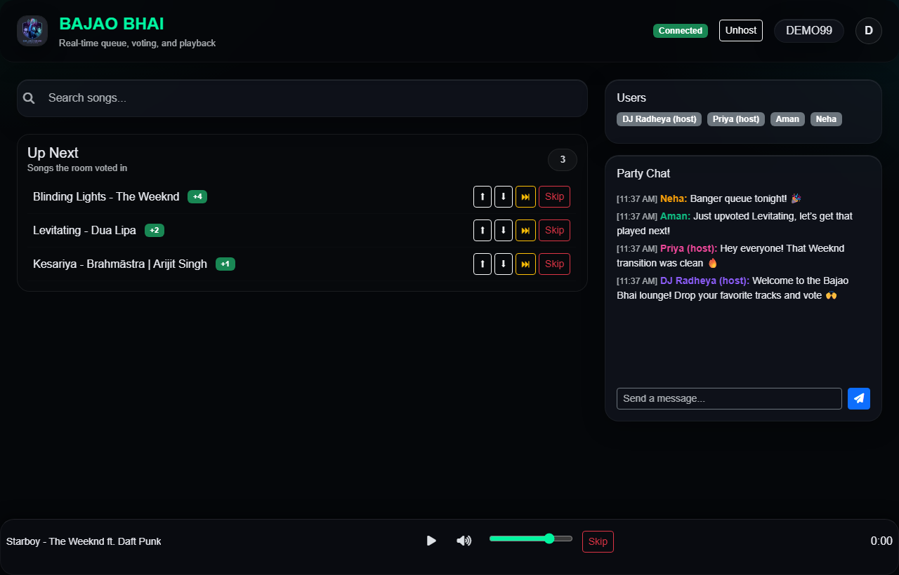
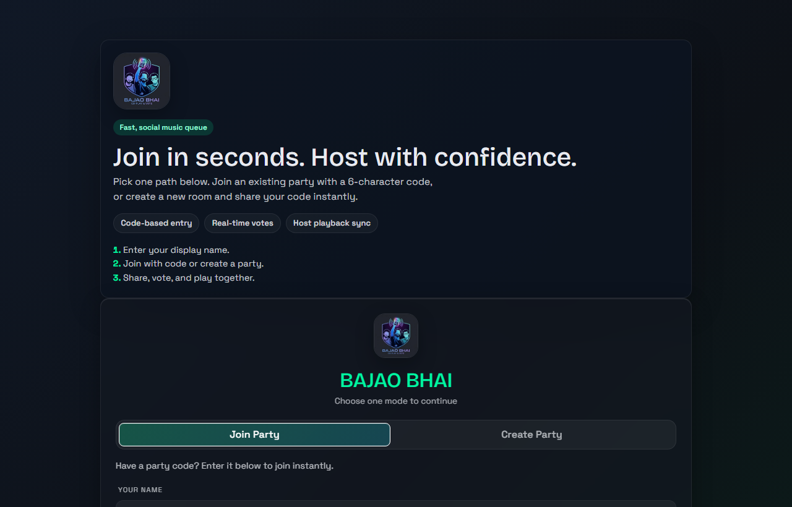
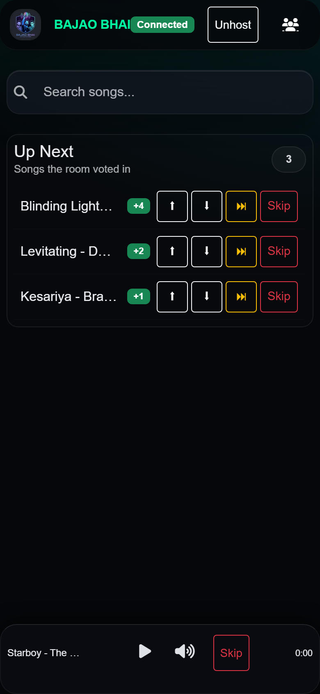
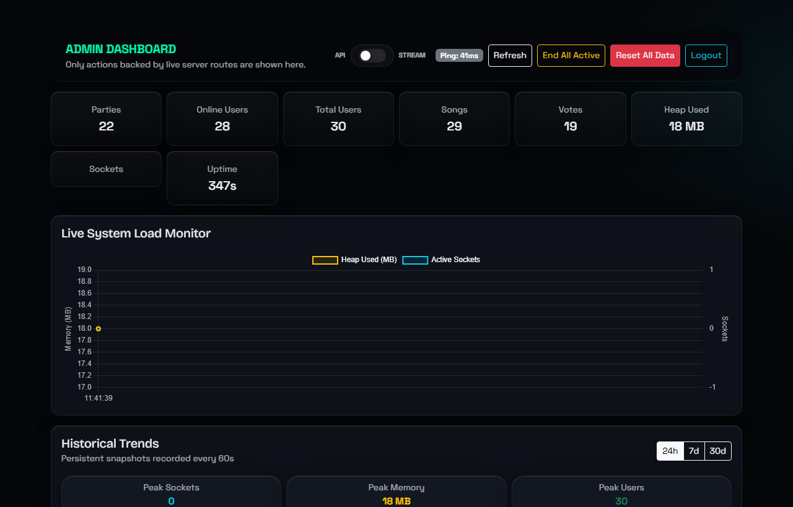

<div align="center">

# 🎵 BAJAO BHAI

**Real-time collaborative party music queue with live synchronized playback, democratic voting, and instant host handover.**

[](https://nodejs.org/)
[](https://socket.io/)
[](https://github.com/WiseLibs/better-sqlite3)
[](test/)
[](client/)
[](LICENSE)

[Features](#-features) • [Screenshots](#-screenshots) • [Architecture](#-architecture) • [Getting Started](#-getting-started) • [Testing](#-testing) • [Browser Compatibility](#-browser--platform-compatibility)

</div>

---

## 📸 Screenshots

### 🎧 Live Party Room
Collaborative queue with real-time net scores (+4, +2, +1), live chat, room member presence, and synced media player bar.
<div align="center">
  
</div>

---

### 🚀 Landing & Room Onboarding
Instant 6-character room code entry or single-click party creation with customizable guest names.
<div align="center">
  
</div>

---

### 📱 Responsive Mobile View (iOS & Android)
Tailored for mobile viewports with touch manipulation, safe-area insets, mobile slide-in chat drawer, and persistent bottom controls.
<div align="center">
  
</div>

---

### 🛡️ Admin & Moderation Panel
Live system telemetry, heap memory tracker, socket counts, table inspector, playback toggle (YouTube API vs. direct Stream Proxy), and room moderation.
<div align="center">
  
</div>

---

## ✨ Features

- **Democratic Music Queue**: Upvote and downvote songs in real time. Songs re-order dynamically based on net community votes.
- **Precision Playback Synchronization**:
  - Sub-second drift correction between host and guests.
  - Native YouTube IFrame API support alongside low-latency native audio stream proxy (`/api/v1/stream/:id`).
  - Seamless background tab re-synchronization (`visibilitychange` triggers immediate catch-up).
- **Auto Host Handover**: If the host disconnects or clicks **Unhost**, host authority transitions seamlessly to the next active guest.
- **Skip Vote Democracy**: Configurable skip-vote threshold triggers automatic next-track transition when enough guests vote to skip.
- **Zero-Friction Mobile Experience**:
  - Full viewport scaling (`100dvh`, `env(safe-area-inset-bottom)`).
  - Touch-optimized tap targets (min 40px), `-webkit-tap-highlight-color: transparent`, and smooth offcanvas member/chat drawer.
  - MediaSession API integration for native lock screen & notification controls on Android and iOS.
- **Production-Grade Reliability**:
  - Atomic SQLite transactions with safe startup schema migrations.
  - Protection against replay constraint collisions (allows re-queueing previously played favorites).
  - Stream proxy abort handler prevents socket descriptor and memory leaks.
  - Scalable Redis adapter support for multi-instance deployments.

---

## 🏗️ Architecture

```text
┌────────────────────────────────────────────────────────┐
│               Client Tier (Vanilla JS + CSS)           │
│  - app.js (controller)         - style.css (responsive)│
│  - modules/player.js (sync)    - modules/socket.js (WS)│
│  - modules/ui-render.js        - modules/chat.js       │
└────────────────────────┬───────────────────────────────┘
                         │ REST / WebSocket (Socket.IO)
┌────────────────────────▼───────────────────────────────┐
│               Server Tier (Node.js Express)            │
│  - server/sockets/queueHandler.js (state & lock sync)  │
│  - server/routes/party.js, queue.js, vote.js           │
│  - server/routes/stream.js (audio stream proxy)        │
│  - server/routes/admin.js (protected telemetry & db)   │
└────────────────────────┬───────────────────────────────┘
                         │
        ┌────────────────┴────────────────┐
        │                                 │
┌───────▼───────────────┐        ┌────────▼──────────────┐
│  SQLite (better-sqlite3)│      │  Redis (Optional)     │
│  - schema_v3.sql       │       │  - Shared queue cache │
│  - Atomic transactions │       │  - Socket.IO adapter  │
└────────────────────────┘       └───────────────────────┘
```

---

## 🌐 Browser & Platform Compatibility

Bajao Bhai is verified across mobile, tablet, laptop, and desktop browsers:

| Browser / Platform | Status | Features Verified |
| :--- | :---: | :--- |
| **Google Chrome (Windows/macOS/Linux)** | 🟢 Full | YouTube API, WebSockets, HTML5 Stream, MediaSession |
| **Microsoft Edge (Windows)** | 🟢 Full | Hardware acceleration, MediaSession, Low latency sync |
| **Mozilla Firefox (Windows/Linux)** | 🟢 Full | Full compatibility, CSS backdrop-filter fallback |
| **Apple Safari (iOS 15+)** | 🟢 Full | Safe-area insets, mobile slide-in drawer, audio unlock |
| **Google Chrome (Android 10+)** | 🟢 Full | Touch manipulation, lock screen media controls, PWA |
| **Samsung Internet / Opera** | 🟢 Full | Responsive viewport `dvh`, quick search debounce |

---

## 🚀 Getting Started

### 1. Prerequisites
- **Node.js**: `v18.0.0` or higher (Node 20+ recommended)
- **npm**: `v9.0.0` or higher

### 2. Installation
```bash
# Clone repository
git clone https://github.com/radheyashetty/BajaoBhai.git
cd BajaoBhai

# Install dependencies
npm install
```

### 3. Environment Configuration
Create a `.env` file in the project root:
```bash
cp .env.example .env
```

Ensure your `.env` contains:
```env
PORT=3002
TOKEN_SECRET=your_super_secret_jwt_key_at_least_32_chars
ADMIN_SECRET=your_admin_secret_key_for_telemetry
YOUTUBE_API_KEY=your_optional_youtube_data_api_v3_key
```

### 4. Start the Application
```bash
# Run in development mode (with auto-reload)
npm run dev

# Run in production mode
npm start
```

Open [http://localhost:3002](http://localhost:3002) in your browser.

---

## 🧪 Testing

The repository includes a comprehensive, native unit and integration test suite:

```bash
# Run all tests and ESLint code checks
npm test
```

### Test Suite Summary:
- `test/validators.test.js`: Validates YouTube video IDs, party codes, and input sanitization against injection.
- `test/token.test.js`: Tests JWT cryptographic signing, claim validation, and tamper rejection.
- `test/db.test.js`: Validates schema integrity, transaction commit/rollback, and re-queueing of previously played songs.
- `test/party.test.js`: Verifies 6-character party code generation, collision resistance, and persistence.
- `test/queue.test.js`: Tests net score ranking, vote toggle transitions, and queue order.
- `test/admin.test.js`: Tests health tracking, alert clearing, and telemetry.
- `test/multiuser.test.js`: Real-time multi-client integration tests for concurrent users, dynamic voting reordering, synchronized playback broadcast, chat, and host handover.

---

## 📁 Project Structure

```text
BajaoBhai/
├── client/                     # Static frontend assets
│   ├── index.html              # Landing & party entry page
│   ├── party.html              # Main collaborative party room
│   ├── admin.html              # Admin monitoring dashboard
│   ├── app.js                  # Frontend controller
│   ├── style.css               # Mobile-first responsive glassmorphic styles
│   └── modules/                # Modular client architecture
│       ├── constants.js        # Configurable client timings & thresholds
│       ├── dom.js              # Cached DOM queries
│       ├── player.js           # Playback sync & drift correction
│       ├── socket.js           # Socket.IO event router
│       ├── state.js            # Client state store
│       ├── ui-render.js        # Queue and user list rendering
│       └── utils.js            # Helpers & formatters
├── server/                     # Backend application
│   ├── index.js                # Express & Socket.IO server entry
│   ├── db.js                   # better-sqlite3 wrapper & safe migrations
│   ├── routes/                 # REST API endpoints
│   │   ├── admin.js            # Admin metrics & DB management
│   │   ├── party.js            # Party creation & validation
│   │   ├── queue.js            # Queue retrieval & song additions
│   │   ├── search.js           # YouTube search & suggestions
│   │   ├── stream.js           # Audio proxy with leak-free abort handlers
│   │   └── vote.js             # Atomic vote transactions
│   ├── sockets/                # Real-time event handlers
│   │   ├── chatHandler.js      # Room chat & typing indicators
│   │   └── queueHandler.js     # Queue lock, syncNowPlaying, & playback
│   └── utils/                  # Backend utilities (JWT, Redis, logger, validators)
├── db/
│   └── schema_v3.sql           # SQLite relational schema
├── docs/
│   └── screenshots/            # High-resolution UI screenshots
├── scripts/                    # Maintenance & automation scripts
│   ├── capture_screenshots.js  # Headless Chrome CDP screenshot capture
│   └── seed_demo.js            # Demo party populator
└── test/                       # Automated test suite (35 unit & integration tests across 7 test suites)
```

---

## 📄 License

This project is licensed under the [MIT License](LICENSE).
